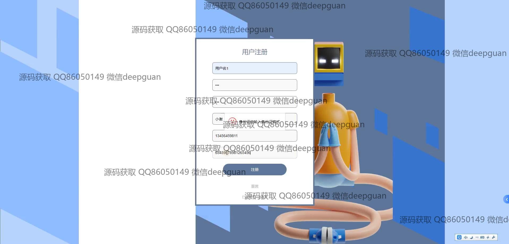
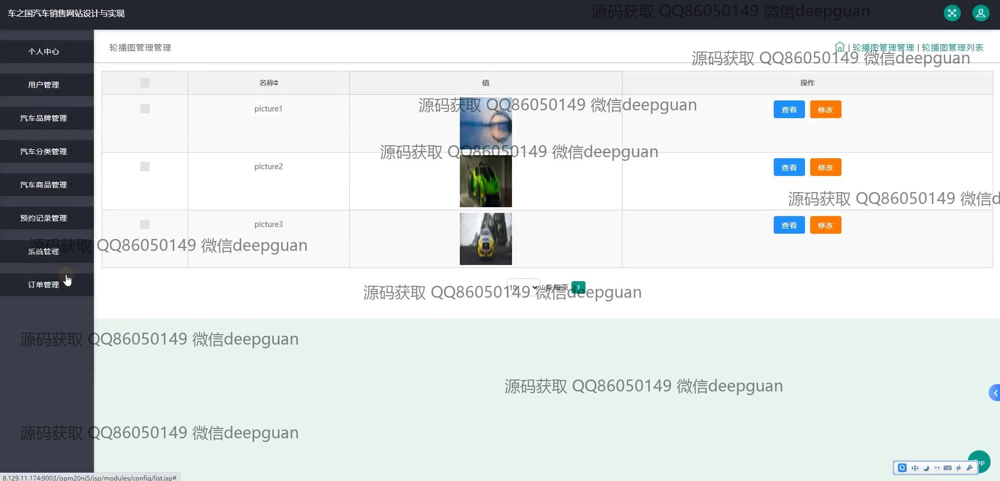

<h1 align="center">-车之国汽车销售网站设计与实现-</h1>

## 简介
车之国汽车销售网站：角色分为管理员和用户；提供用户管理、订单管理、汽车品牌管理、商品管理、评论管理、在线支付、收藏管理、公告发布等功能，实现汽车销售各环节的高效操作与管理。    --计算机毕业设计源码；毕设源码；java毕业设计源码

## 联系方式

<h3 align="center">获取完整代码与数据库文件 + 微信：deepguan QQ: 86050149 QQ群: 783742310</h3>

<h3 align="center">可帮忙远程部署 包运行成功！提供远程部署、修改代码、设计文档指导、代码讲解等服务！</h3>

## 功能介绍（完整见运行截图）
管理员：可以进行网站的登录和注册，通过后台管理界面管理整个网站功能，包括用户管理、汽车品牌管理、汽车分类管理、商品管理、订单管理、评论管理等。在汽车品牌管理中，管理员可以查询、添加或删除品牌信息。订单管理功能支持查看订单详细信息并进行发货操作，同时支持分页查看订单。在商品管理中，管理员可以发布公告并编辑商品配置信息，通过宣传视频和图片管理提高商品展示效果。

用户：可以通过网站首页访问导航栏提供的多种功能模块，包括汽车商品、公告信息、个人中心、后台管理、购物车和客服咨询等。用户能够注册个人账户并登录系统，操作用户中心的功能，如查看和修改个人信息、管理地址、收藏车辆，以及查看预约记录。在商品页面，可以浏览汽车详细信息，选择添加到购物车或立即购买，并进行预约试驾和评论功能。支付页面支持多种支付方式完成购买操作。

## 运行截图

本代码来源于网络,仅供学习参考使用!

